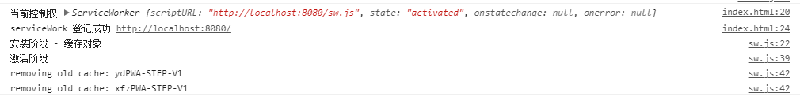
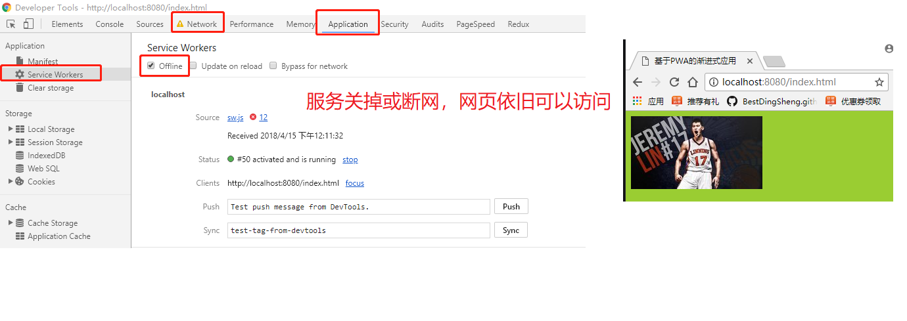

# PWA
## 简介
> Progressive Web App, 简称 PWA，是提升 Web App 的体验的一种新方法，能给用户原生应用的体验
> PWA 本质上是 Web App,并且不需要从应用商店下载
> 特点:
> > - 可靠 - 即使在不稳定的网络环境下，也能瞬间加载并展现
> > - 体验 - 快速响应，并且有平滑的动画响应用户的操作
> > - 粘性 - 像设备上的原生应用，具有沉浸式的用户体验，用户可以添加到桌面

## example
```
//注册PWA
if('ServiceWorker' in window){
    console.log('当前控制权', navigator.serviceWorker.controller)
    // 注册PWA
    navigator.serviceWorker.register('./sw.js')
    .then(function(regist){
      console.log('serviceWork 登记成功', regist.scopelocalhost:8080/
    })
    .catch(function(err){
        console.log('serviceWork 登记失败', err)
    })
}
--------------sw.js---------------------
/**
 * PWA应用 逻辑 
 */

//缓存的名字
const cacheName = 'xfzPWA-STEP-V1';
//缓存内容列表
const filesToCache = [
    "/js/index.js",
    "/css/index.css",
    "/images/1.jpg",
    "/index.html",
    "/"
];
// 全局变量 self caches
// self 表示ServiceWork 作用域 也是全局变量
// caches 缓存对象
// 安装
self.addEventListener('install', function(e){
    console.log('安装阶段 - 缓存对象')
    e.waitUntil(updateStaticCache())
})
function updateStaticCache(){
    return caches.open(cacheName)
        .then(function(cache){
            //原子操作 如果中间某一个文件挂了 全部缓存失败
            return cache.addAll(filesToCache)
        })
        // 在页面更新中 新的 serviceWork 马上生效
        .then(() => self.skipWaiting())
}
// 激活
self.addEventListener('activate', function(e){
    //移除过期的缓存对象，保证新的更新进入
    console.log('激活阶段')
    e.waitUntil(caches.keys().then(function(keyList){
        return Promise.all(keyList.map(function(key){
            console.log('removing old cache:', key)
            if(key !== cacheName){
                return caches.delete(key)
            }
        }))
    }))
})
// 拦截
self.addEventListener('fetch', function(e){
    console.log(e.request);
    // e.respndWith(new Response('Hello world'))
    // 替换网页内容
    e.respondWith(
        caches.match(e.request).then(function(response){
            return response || fetch(e.request)
        })
    )
})
```



## 学习参考
> LAVAS （https://lavas.baidu.com/）